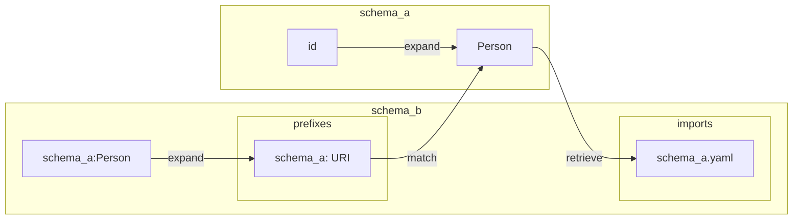
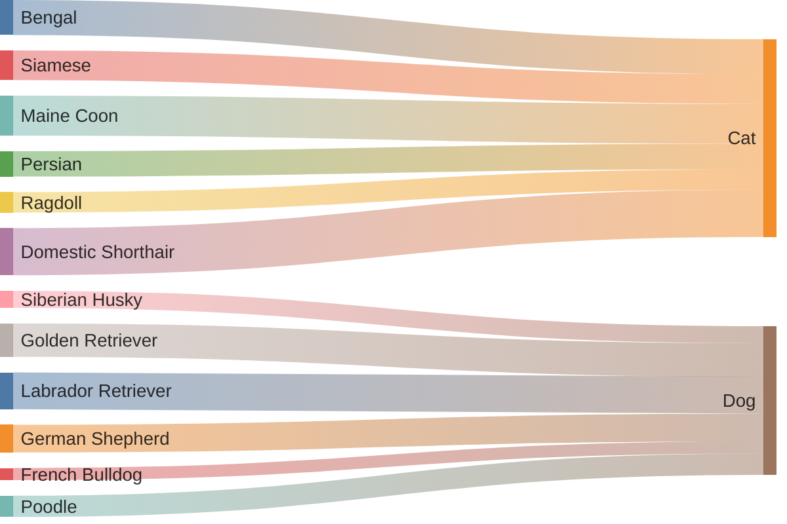

# Experimenting with GitHub diagram creation
Example from https://github.com/orgs/linkml/discussions/1739#discussioncomment-8836361

Here is code for invoking mermaid in a markdown file; below that is the diagram that is rendered.

````markdown
```mermaid
flowchart LR
    subgraph schema_b
    subgraph prefixes
    sch_b[schema_a: URI]
    end
    subgraph imports
    sch_b_yaml[schema_a.yaml]
    end
    schema_a:Person
    end

    subgraph schema_a
    direction TB
    id
    Person
    id -- "expand" --Person
    end

    sch_b -- "match" --Person
    schema_a:Person -- "expand" --sch_b
    Person -- "retrieve" --sch_b_yaml
```
````

Diagram produced by that code:


Here's a simpler example:
````markdown

````


From @Harry:
I just learned that Mermaid will do Sankeys as well:

````markdown

````

makes something like


and since GH will render Mermaid, release notes could include autogenerated Sankeys displaying the extent of changes, like


